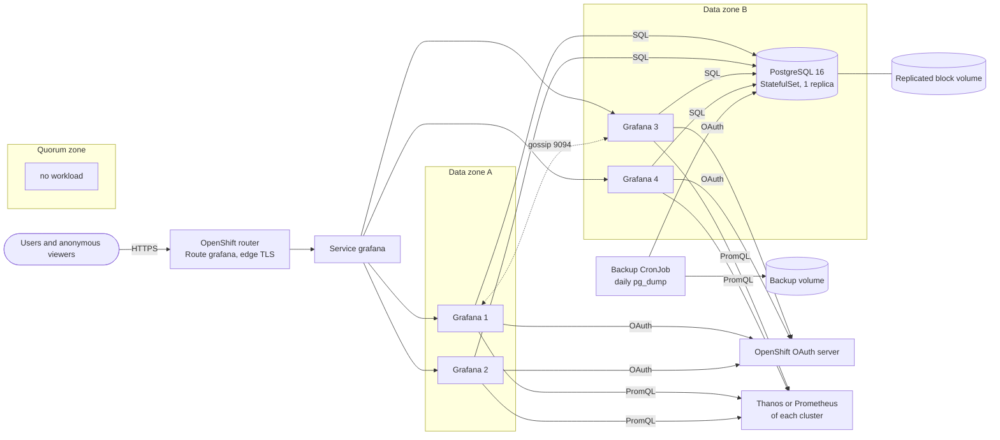

# Architecture

## Components

The diagram puts PostgreSQL in zone B, but it can run in either data zone and
follows its volume.

| Concern | Design |
|---|---|
| State | PostgreSQL holds dashboards, folders, users, permissions, alert rules and sessions. The Grafana pods keep nothing: `/var/lib/grafana` is an emptyDir used as a cache. |
| Grafana availability | There are 4 replicas, 2 per data zone (soft spread) and at most one per node (hard rule). A PodDisruptionBudget allows one pod down at a time, rolling updates use `maxUnavailable: 0`, and each pod waits 10 seconds before stopping so the router can drain it. |
| PostgreSQL availability | A single instance runs on a volume that the storage layer replicates. If its node fails, the pod restarts on another node with the same data. It has no PodDisruptionBudget, so it never blocks a node drain during a cluster upgrade. |
| Zones | Every workload has a required node affinity to the two data zones. Nothing from this project runs in the quorum zone. |
| Alerting | Unified alerting runs in HA mode. The replicas share silences and notification state through the headless service, with gossip on port 9094. |
| Login | Grafana uses generic OAuth against the OpenShift OAuth server and maps OpenShift groups to Admin, Editor or Viewer. The local `admin` account remains for break-glass access. |
| Sharing | Anonymous users get the Viewer role on the main organisation. A folder is public when the Viewer role can see it. |
| Datasources | They come from `values-local.yaml` with fixed uids. Adding one restarts the replicas one at a time and loses nothing. |

## Failure behaviour

| Event | Effect on users | Recovery |
|---|---|---|
| One Grafana pod killed | Nothing measurable. The test saw 0 failed requests out of 458. | The Deployment replaces it within seconds. |
| All Grafana pods deleted at once | Grafana is down until the first new pod is ready, about 20 seconds. | The content survives because it lives in PostgreSQL. |
| One node lost | The other 3 replicas serve while the lost one starts elsewhere. | Automatic. |
| One data zone lost | The 2 replicas in the other zone keep serving, and the lost ones start again in that zone. Draining a zone in the test gave 0 failed requests out of 607. | Automatic. The replicas spread out again when the zone comes back. |
| PostgreSQL node lost | Grafana returns errors until PostgreSQL restarts on another node. That takes 1 to 2 minutes, plus up to 5 minutes for Kubernetes to declare the node lost. | Automatic, and the replicated volume keeps the data. |
| Corrupted database or bad change | Users see wrong content. | Run `scripts/db-restore.sh` with a daily dump. |
| Cluster lost | The service is gone. | Deploy on another cluster and restore a dump that was copied off the cluster. |

## Options we ruled out

SQLite on a persistent volume allows a single writer, so several replicas cannot
share it, and losing the volume loses everything. SQLite inside the pod is what
caused the original problem of dashboards disappearing after a restart.

A PostgreSQL operator such as CloudNativePG or Crunchy would add streaming
replication and faster failover. It also means installing and running an
operator, which the requirements exclude. If you already have a managed
PostgreSQL outside the cluster, point `grafana.ini [database]` at it and skip
the base manifests.

An oauth-proxy sidecar would force a login on every request, which rules out
anonymous sharing.

Grafana's "Share externally" feature (public dashboards) does not support
template variables or repeated rows, so the existing dashboards would render
empty.
